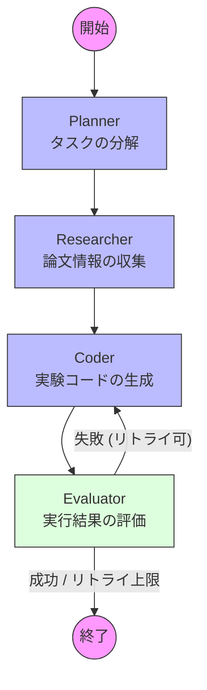

# AROS v0.1: LangGraph ワークフロー図 (モック版)

この図は、v0.1で構築する「最小限のループ」を示しています。各ノード（Planner, Researcherなど）は、現時点では実際のAIではなく、**「モック（Mock）」**として実装されます。

## 1. ワークフロー構造 (Mermaid)

## 2. v0.1での各ノードの役割（モックの内容）

「モック」とは、本物のAIや複雑なプログラムの代わりに、**「決まった値を返すだけの仮のプログラム」**のことです。

なぜモックを使うのか？
- AI APIの料金を節約するため。
- インフラ（RunPodなど）が未完成でも、全体の「流れ（グラフの遷移）」が正しいかテストするため。
- データの器（State）が壊れないか確認するため。

| ノード | モックの実装内容 (v0.1) |
| :--- | :--- |
| **Planner** | 固定の「サブタスク1, 2, 3」を `AgentState` に書き込むだけ。 |
| **Researcher** | ダミーの論文タイトルを1つ `research_context` に追加するだけ。 |
| **Coder** | `print('Hello World')` という文字列を `generated_code` に入れるだけ。 |
| **Evaluator** | 常に `success=True`（またはランダムに `False`）を返し、ループを終わらせる。 |

## 3. 次のステップ
1. [graph/nodes/](graph/nodes/) 配下に、これらの「仮の関数」を作成します。
2. [graph/edges.py](graph/edges.py) で、「失敗したらCoderに戻る」という条件分岐ロジックを書きます。
3. [graph/__init__.py](graph/__init__.py) で、これらを繋ぎ合わせて一つの「グラフ（脳の構造）」を完成させます。
